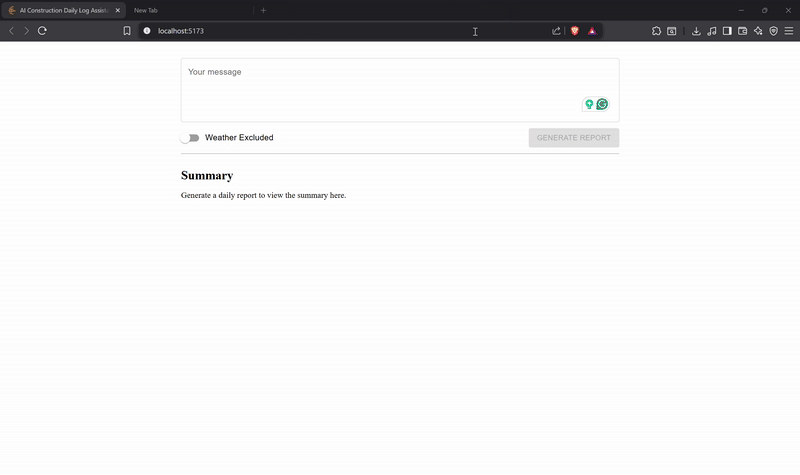

# AI Daily Log Assistant
An AI-powered web app that helps construction teams generate structured daily log reports from natural language inputs. Built with React.js and powered by the Gemini API, the tool streamlines documentation, enhances productivity, and ensures consistent record-keeping across construction projects.

<div align="center">
  
</div>

## Tech Stack
- 
- 
- 
- 


## Problem Statement
Every day during construction, site supervisors take rough daily notes (weather, work done, issues) that later need to be compiled into a formal report for communication and ease of use. However, this process is highly inefficient because it takes a lot of time, which may cause delays or miscommunication, affecting the whole construction process. There should be an AI agent that automates the conversion of scattered notes into a structured format that eases communication between project managers and field engineers.

**Who Gets Affected:**

- **Construction Supervisors**: have to format everything at the end of the day, which is time-consuming and inefficient.  
- **Project Managers**: depend on daily logs for decision-making and coordination. Late or unclear logs slow down the project and increase risk.

## Run Locally

Instead of running locally, you can try the web app online [here](https://edecs-assessment-ai-daily-log-assis.vercel.app/).

Clone the project

```bash
  git clone https://github.com/AdhamElRouby/edecs-assessment-ai-daily-log-assistant.git
```

Go to the project directory

```bash
  cd .\edecs-assessment-ai-daily-log-assistant
```

Open with VSCode

```bash
  code .
```

Install dependencies

```bash
  npm install
```

Open with live server

```bash
  npm run dev
```

**Note:**  
To quickly try out the AI assistant, you can copy one of the sample inputs from the `src/examples` folder and paste it into the input box on the main page.


## Key Design Choices & Features

### 🚀 Features
- Users can input unstructured notes and optionally choose to include the current weather.
- Generated summaries can be exported as a PDF.

### 🧠 Key Design Choices
- The app is structured around two main components:  
  - **Form Component**: Handles user input and includes the `WeatherToggleSwitch` component.  
  - **Summary Component**: Displays the LLM response and uses the `MarkdownParser` component to render the content.
  
- **Material UI** was used for building a modern and ineractive UI quickly.
- **TypeScript** ensures safe typing and better development experience.
- **Global State Management** is handled using React's `useContext()` API via two contexts:  
  - `GeminiContext`: Manages loading states, error messages, and Gemini API responses.  
  - `WeatherDataContext`: Manages whether to include weather data and allows toggling this option.

- **Gemini API (gemini-2.5-flash free model)** is used to generate structured summaries from unstructured input.
- **Geolocation API** and **OpenWeatherMap API** are used in the custom hook `useGetWeather` to get the user’s current weather.
- **react-markdown** parses the Gemini response (in Markdown) into rendered HTML.
- **html2pdf.js** is used to export the final summary as a downloadable PDF.
- The sample notes in the `src/examples` folder were AI-generated using ChatGPT.


## Contributing

I welcome contributions to this project! Feel free to submit pull requests and suggest improvements. 
If you have any questions or need assistance, don’t hesitate to contact me at adhamelrouby@aucegypt.edu.
